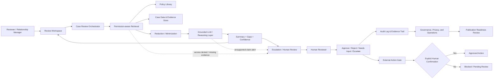

<!-- markdownlint-disable-file -->

# Architecture notes: FSI Relationship Manager Assistant MVP

## Linked implementation phases

* [Phase 1: Evidence validation and scope lock](../../.copilot-tracking/plans/2026-09-18/fsi-relationship-manager-assistant-mvp-plan.md#p01)
* [Phase 2: Interaction design and grounded-response model](../../.copilot-tracking/plans/2026-09-18/fsi-relationship-manager-assistant-mvp-plan.md#p02)
* [Phase 3: Permission-aware retrieval and evidence assembly](../../.copilot-tracking/plans/2026-09-18/fsi-relationship-manager-assistant-mvp-plan.md#p03)
* [Phase 4: Human-in-the-loop decision workflow and external action guardrails](../../.copilot-tracking/plans/2026-09-18/fsi-relationship-manager-assistant-mvp-plan.md#p04)
* [Phase 5: MVP validation, observability, and readiness review](../../.copilot-tracking/plans/2026-09-18/fsi-relationship-manager-assistant-mvp-plan.md#p05)

## Overview

This architecture reflects the approved requirements and MVP plan: a source-grounded review assistant for FSI relationship or compliance cases, designed to help users prepare and validate cases without replacing human accountability. The MVP narrows the problem to one well-scoped job: case preparation and exception detection with explicit uncertainty and human signoff before any external action.

## Review inputs and architectural scope

This solution review is based on the current implementation plan, product requirements, and user experience evidence:

* [Implementation plan](../../.copilot-tracking/plans/2026-09-18/fsi-relationship-manager-assistant-mvp-plan.md)
* [Product requirements draft](../../.copilot-tracking/prd-sessions/compliance-check-system-prd.md)
* [Experience outline](../../.copilot-tracking/dt/compliance-check-system-experience-outline.md)

The architecture boundary for this phase is intentionally narrow: the core solution is an enterprise review-support workflow, plus a potential Microsoft 365 agent companion experience for assisted interaction. The agent is not the authority for final decisions and does not replace the enterprise service or policy approval flows.

## 1. Solution approach by phase

### Phase 1: Evidence validation and scope lock

Simple approach:

* Confirm the exact workflow, evidence sources, and policy sources for the MVP.
* Define allowed case types, user roles, risk tiers, and escalation owners.
* Document what is in-scope and out-of-scope for the first release.

Major tradeoffs:

* Narrow scope reduces complexity, but it may delay broader relationship-management workflows.
* Stronger evidence validation improves trust but requires more upfront governance and product alignment.

### Phase 2: Interaction design and grounded-response model

Simple approach:

* Create a structured review workspace rather than a free-form chat experience.
* Require citations, confidence, and a visible difference between recommendation and final decision.
* Build a low-risk response pattern: summary, evidence, uncertainty, and escalation signal.

Major tradeoffs:

* A structured UI is easier to audit and safer for compliance workflows, but it is less conversational and more constrained.
* Verbose rationale improves trust but can slow reviewers and increase cognitive load if not condensed.

### Phase 3: Permission-aware retrieval and evidence assembly

Simple approach:

* Retrieve only the minimum necessary policy texts and case materials the user is allowed to access.
* Assemble evidence with source IDs, document scope, and classification metadata.
* Filter sensitive data before model input and surface missing or inaccessible evidence clearly.

Major tradeoffs:

* Overly strict retrieval reduces false positives but may miss edge cases or necessary context.
* Broad retrieval improves recall but increases privacy risk and response latency.

### Phase 4: Human-in-the-loop decision workflow and external action guardrails

Simple approach:

* Keep the assistant in review-support mode only.
* Require explicit human confirmation for any outbound action or formal decision.
* Route low-confidence, contradictory, or high-risk cases to escalation.

Major tradeoffs:

* Strict guardrails improve safety but may reduce convenience for routine cases.
* More automation could speed throughput, but it would conflict with the approved human-accountability requirement.

### Phase 5: MVP validation, observability, and readiness review

Simple approach:

* Run realistic synthetic review scenarios and measure groundedness, escalation behavior, and source traceability.
* Validate logging, privacy controls, and governance readiness.
* Keep publication claims provisional until Microsoft guidance and tenant feasibility are checked.

Major tradeoffs:

* A pilot with narrow scenarios is easier to govern but risks underestimating real-world edge cases.
* Broad pilot evaluation improves confidence but requires more setup and operational support.

## 2. Cloud architecture

### High-level architecture

The MVP can be implemented with a simple, modular pattern:

* Client-facing review experience (web app or Teams-style workflow shell)
* API orchestration layer
* Retrieval and policy service
* Model inference layer
* Case and audit store
* Policy and evidence connector layer
* Action approval and escalation workflow

### Recommended cloud pattern

A Microsoft-centric, cloud-ready architecture is appropriate for this scenario:

* App front end in a secure enterprise environment, such as a web app or internal portal.
* Azure-hosted workflow and orchestration service for the case review pipeline.
* Azure storage or equivalent secure data store for case data, audit logs, and source metadata.
* Retrieval layer that accesses only approved internal/document sources and policy material.
* Azure AI or similar model endpoint for grounded summarization and comparison.
* Identity, RBAC, and data-classification controls enforced before retrieval and logging.

### Key design principles

* Least privilege for retrieval and action execution
* Explicit source grounding for every recommendation
* Traceable audit history for user decisions and escalation events
* Fail-safe behavior: uncertain or risky cases stop for human judgment
* Minimal prompt data and selective redaction of sensitive information

## 3. Well-architected concerns

### Reliability

* The system should fail closed for unsupported or missing evidence.
* Low-confidence results should not be presented as firm conclusions.
* Retrieval failures and ungrounded outputs must trigger explicit review.

### Security

* Enforce RBAC and data-access policy before case retrieval.
* Redact or minimize sensitive fields before model inference.
* Keep data in approved systems and limit prompt logging to the minimum required for auditability.

### Privacy and compliance

* Data classification and retention policies must be confirmed before implementation.
* Source-grounded outputs should cite approved policy references rather than inferred interpretations.
* Audit logs must support traceability without retaining unnecessary sensitive content.

### Operational excellence

* Observability should track prompt usage, retrieval sources, confidence, escalation rate, and rejection rate.
* Ownership for exception handling and governance should be explicit.
* Test plans should cover missing evidence, contradictory signals, and high-risk cases.

### Performance efficiency

* Retrieval should be targeted and bounded.
* The workflow should prioritize a minimal set of relevant sources before model generation.
* Fast triage, then deeper review for escalated cases, reduces cost and latency.

### Sustainability and cost

* Keep early-phase inference focused on high-value review tasks rather than broad-case analysis.
* Use a small but safe prompt scope and narrow fetches for routine triage.
* Reserve deeper analysis for escalated or higher-risk cases.

## 4. Publication assumptions for solution review

### Preferred Marketplace model

For this solution review, the preferred deployment model is a tenant-scoped enterprise solution that exposes a review-support workflow and an optional companion Microsoft 365 agent experience, rather than a direct Marketplace-first launch. The architecture assumption is that the enterprise platform remains the primary product boundary and that any Microsoft 365 agent is a companion surface, not the system of record.

Assumptions:

* The primary product is the enterprise review assistant and its governed APIs.
* A Microsoft 365 agent is a potential companion experience for review assistance and quick access to case summaries.
* The Marketplace model is treated as a future packaging and distribution option, not an MVP dependency.
* Marketplace-ready packaging, offer validation, pricing, monetization, certification, and rollout planning are explicitly deferred to the Partner Workshop Publishing Follow-Up.

### Product boundaries

The architecture keeps these product boundaries explicit:

* Core service: enterprise review workflow, evidence retrieval, policy comparison, escalation flow, audit logging, and approval enforcement.
* Companion experience: Microsoft 365 agent that surfaces contextual guidance and summary actions while operating through the same governed service.
* System of record: case-management, policy, and evidence repositories owned by the tenant or operating organization.
* Decision authority: human reviewer remains accountable for final approval or rejection, regardless of agent or marketplace packaging.

### API, identity, permission, and data contract

The solution review assumes a simple service contract between the enterprise review service and the companion Microsoft 365 experience.

API contract assumptions:

* The enterprise service exposes read-only case-summary and review-support endpoints for approved scenarios.
* The companion agent calls the service through a tenant-scoped, authenticated API boundary.
* The service returns structured metadata, not raw authority-bearing decisions.
* Action endpoints remain separate from analysis endpoints and require explicit human approval.

Identity and permission assumptions:

* All users authenticate through tenant identity and Entra-based access controls.
* The agent and the service both enforce user role, case access, and data permissions before retrieval or display.
* Role-based access controls define which users can view, escalate, or approve a case.
* No external or consumer identity is assumed for regulated case review.

Data contract assumptions:

* Input payload includes case ID, tenant ID, user role, evidence references, and policy context.
* Response payload includes summary, evidence references, confidence, escalation state, and audit ID.
* Sensitive or regulated fields are minimized or redacted before model input and before any companion-agent display.
* A decision record or approval event is stored in the audit log with evidence references and reviewer identification.

### Architecture constraints and unresolved decisions

Required constraints:

* Human approval remains mandatory before any outbound action or formal case decision.
* All recommendations must be traceable to approved source material or clearly marked as unsupported.
* The review service stays authoritative for evidence retrieval and final decision-state logic.
* The agent is a presentation or assistance layer, not a decision authority.

Unresolved decisions to be made by the owning team:

* Whether the companion Microsoft 365 agent is a first-party tenant integration or a partner-hosted companion surface.
* Which tenant systems are authoritative for case data, policy references, and approval metadata.
* Which evidence and policy sources are required for the MVP, and which remain out-of-scope.
* Whether the review workflow is exposed as a web app, Teams-style experience, or both.

Owners needed for integration decisions:

* Product owner for the review workflow and MVP scope
* Security and compliance owner for data classification and approval boundaries
* Identity and platform owner for Entra and permission model
* Data owner for the case and policy source systems
* Microsoft publication owner for the future Marketplace or Copilot agent packaging assessment

### Deferred follow-up work

Marketplace implementation planning, offer validation, pricing, monetization, Partner Center configuration, package preparation, certification, and rollout planning are explicitly deferred to the Partner Workshop Publishing Follow-Up.

## 5. Major tradeoffs and design decisions

### Decision 1: Human-led verification over automation

Why:

* The evidence base explicitly requires final decisions to remain with a human reviewer.

Tradeoff:

* Reduced automation speed versus stronger governance and trust.

### Decision 2: Structured review experience over open-ended chatbot

Why:

* The workflow is case review, evidence checking, and escalation support; a structured panel is safer and more auditable.

Tradeoff:

* Lower conversational flexibility versus clearer review flow and better traceability.

### Decision 3: Narrow but safe MVP scope

Why:

* The plan is intentionally limited to one grounded review job and one approval gate.

Tradeoff:

* Less feature breadth now, but a stronger foundation for later expansion.

### Decision 4: Source-grounded evidence first, publication later

Why:

* The product value is in safe and reliable review support, not in early market claims.

Tradeoff:

* Slower external packaging work versus stronger governance and lower compliance risk.

## 6. Mermaid architecture diagram

## 7. Implementation note

This architecture is intentionally conservative and is designed to match the approved MVP plan and the research evidence. It favors a safe, review-support workflow with explicit traceability, low-confidence escalation, and human authority for decisions. Any broader feature expansion should be gated by the policy source validation, privacy review, and governance checks defined in the implementation plan.
